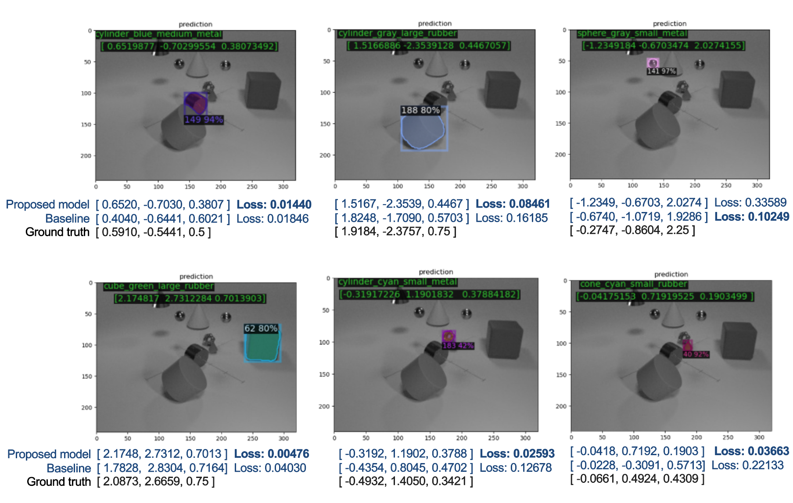

# CATER Object detection 
## Run the code:

Train the model:

```
python cater_train_net.py
```
or 
```
python demo.py -t -o <output_dir>
```
Evaluate the model:

```
python demo.py -e -o <saved_model_weight>
```
Do the inference:
```
python demo.py -i -o <saved_model_weight>
```

## Requirements

### for All Tasks:

1. numpy

2. matplotlib

3. opencv

### for 3D-Coordinates Prediction:

1. Detectron2

2. Pytorch with Torchvision

### for semi-automatic annotation tool

1. scikit-learn

2. opencv-contrib

3. json

## directory_format:

```
.
├── *detectron2 -> /<Your Dir For Detectron2>/ 
├── jupyter-notebook
├── *output
│   └── *best
│    └── *model_final.pth
├── *dataset
│   ├── annotations
│   └── images
│    └── image 
├── *raw_data
│   ├── *clf_data
│   │   ├── hsv.json
│   │   ├── label_dict
│   │   └── sizedata
│   ├── raw_data_from_005200_to_005699
│   │   ├── 005200-005299
│   │   ├── 005300-005399
│   │   ├── 005400-005499
│   │   ├── 005500-005599
│   │   └── 005600-005699
├── scripts
└── test

*: must have

```

## 3D Coordination Prediction

### Compare USE_BACKBONE_FEATURES=False with USE_BACKBONE_FEATURES=True:


### Compare Baseline with Proposed Model:



use the following command to connect to server, password required (provided in the email) if not using SSH key

sh ./connect_server.sh
