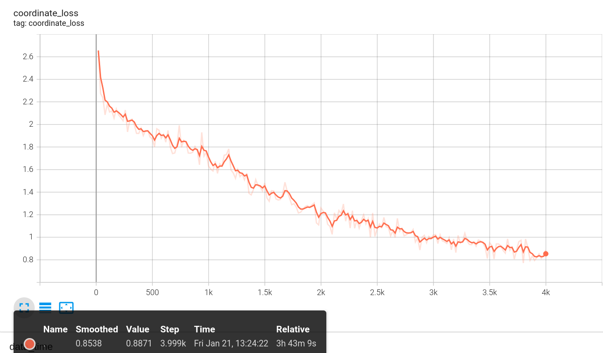

# CATER Object detection 

use the following command to connect to server, password required (provided in the email) if not using SSH key

sh ./connect_server.sh
## Requirements

1. Detectron2

2. Pytorch

3. opencv-contrib

4. matplotlib

## directory_format:

```
.
├── *detectron2 -> /<Your Dir For Detectron2>/ 
├── jupyter-notebook
├── *output
│   └── *best
│    └── *model_final.pth
├── *dataset
│   ├── annotations
│   └── images
│    └── image 
├── *raw_data
│   ├── *clf_data
│   │   ├── hsv.json
│   │   ├── label_dict
│   │   └── sizedata
│   ├── raw_data_from_005200_to_005699
│   │   ├── 005200-005299
│   │   ├── 005300-005399
│   │   ├── 005400-005499
│   │   ├── 005500-005599
│   │   └── 005600-005699
│   ├── all_action_camera_move
│   │   ├── lists
│   │   │   └── localize
│   │   ├── scenes
│   │   └── videos
├── scripts
└── test
    └── __pycache__

*: must have

```

## 3D Coordination Prediction

USE_BACKBONE_FEATURES=False:


USE_BACKBONE_FEATURES=True:
